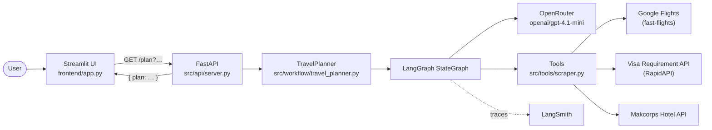
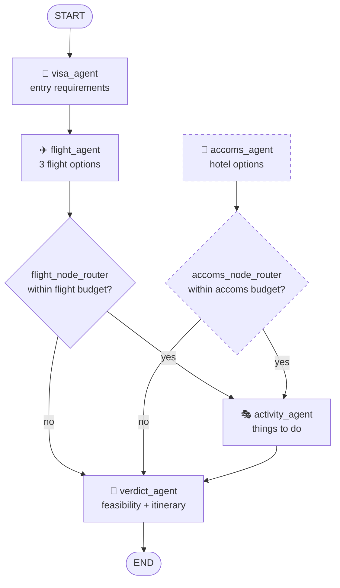

# ✈️ dis-travel-planner

A multi-agent travel planner. You give it a traveller profile (dates, citizenship, origin, destination, budget), and a chain of specialised LLM agents works out your **visa requirements**, **flights**, **accommodation**, and **activities** — then a final agent decides whether the trip is actually feasible and writes up a day-by-day itinerary.

Built with **LangGraph** (agent orchestration), **FastAPI** (backend API), and **Streamlit** (frontend form).

---

## Table of Contents

- [How it works](#how-it-works)
- [Architecture](#architecture)
- [The agents](#the-agents)
- [Shared state](#shared-state)
- [External services used](#external-services-used)
- [Folder structure](#folder-structure)
- [Getting started](#getting-started)
  - [Prerequisites](#prerequisites)
  - [1. Install dependencies](#1-install-dependencies)
  - [2. Environment variables (required)](#2-environment-variables-required)
  - [3. Run the backend](#3-run-the-backend)
  - [4. Run the frontend](#4-run-the-frontend)
- [API reference](#api-reference)

---

## How it works

In simple terms:

1. **You fill in a form** in the Streamlit UI — travel dates, citizenship, where you're flying from, where you're going, how much you want to spend on flights vs. hotels, and any extra requirements.
2. **The form calls the backend** — a FastAPI service exposes `GET /plan`, which takes the traveller profile as query parameters.
3. **The backend builds a workflow graph.** This is a LangGraph `StateGraph`: a small flowchart where each box ("node") is an AI agent, and the arrows decide who runs next.
4. **Each agent does one job** and writes its findings into a shared `State` object. Later agents can read what earlier agents wrote.
5. **Agents that need real data call tools.** They are explicitly told *not* to guess prices or visa rules — they must call a Python function that hits a live API (Google Flights, a visa-requirements API, a hotel-pricing API).
6. **Budget gates short-circuit the flow.** After the flight agent runs, a router function checks whether the flights fit the flight budget. If not, the graph skips straight to the verdict agent rather than wasting time planning a trip you can't afford.
7. **The verdict agent compiles everything** into a feasibility assessment plus 2–3 itinerary options with costs, pros and cons.
8. **The final plan string is returned** to the frontend as JSON.

Every agent is a LangChain agent (`create_agent`) backed by the same LLM — `openai/gpt-4.1-mini` served through **OpenRouter**. Runs are traced with **LangSmith** if you enable it.

---

## Architecture

### System overview



### The agent workflow graph



> **Note:** `accoms_agent` is registered as a node and has a router, but no edge currently points to it, so it does not execute in the current graph (drawn dashed above).

Every node is wrapped in a `RetryPolicy(max_attempts=3, initial_interval=1.0)`, so a transient LLM or API failure is retried up to three times with backoff before the graph gives up.

---

## The agents

All agents inherit from `BaseAgent` (`src/workflow/base_agent.py`), which just wires up the shared LLM and requires each subclass to define a `generate_prompt()` system prompt. Each agent lives in its own package with a `<name>_agent_node(state)` function — that function is what LangGraph actually calls, and it returns a dict of state fields to merge back in.

| Agent | File | Tool(s) it can call | Writes to state |
|---|---|---|---|
| **Visa Agent** ("Visa & Entry Orchestrator") | `src/workflow/visa_agent/agent.py` | `get_visa_details` | `visa_details` |
| **Flight Agent** ("Flight Scout") | `src/workflow/flight_agent/agent.py` | `get_flight_details` | `flight_details`, `flight_total_cost`, `flight_feasible` |
| **Accommodations Agent** ("Accommodation Scout") | `src/workflow/accoms_agent/agent.py` | `get_hotels` | `accoms_details`, `accoms_total_cost`, `accoms_feasible` |
| **Activity Agent** ("Activity Scout") | `src/workflow/activity_agent/agent.py` | — (pure LLM knowledge) | `activity_details` |
| **Verdict Agent** | `src/workflow/verdict_agent/agent.py` | — (reads everything) | `plan` |

A few details worth knowing:

- **The visa agent** interprets the raw JSON from the visa API using a "logic hierarchy" — it prefers eVisas over physical visas, surfaces mandatory arrival registrations, and checks that the visa duration covers the trip length.
- **The flight agent** resolves cities/countries to IATA airport codes itself, then returns exactly three picks: *Best Value*, *Fastest Route*, and *Comfort Upgrade*.
- **The flight and accommodation agents** are asked to end their output with a `Feasibility: True/False` line and a total cost. The node functions then **regex-parse** that text back out of the response so the routers can act on it — this is the mechanism that connects free-form LLM output to the graph's control flow.
- **The verdict agent** has no tools. It receives the traveller profile plus every other agent's output in one prompt and produces the final plan.

---

## Shared state

Defined in `src/schemas/schemas.py`. This Pydantic model is the single object passed between every node — think of it as the shared notepad.

```python
class State(BaseModel):
    traveller_profile: TravellerProfile
    accoms_details: str = "Accoms Not Available"
    accoms_total_cost: float = 0.0
    accoms_feasible: bool = False
    activity_details: str = "Activities Not Available"
    visa_details: str = "Visa Not Available"
    transport_details: str = "Transport Not Available"
    flight_details: str = "Flight Not Available"
    flight_feasible: bool = False
    flight_total_cost: float = 0.0
    plan: str = ""
```

The input half is `TravellerProfile`:

| Field | Type | Notes |
|---|---|---|
| `start_date` / `end_date` | `date` | Trip window |
| `citizenship` | `str` | Drives visa lookup |
| `start_country` / `start_city` | `str` | Where you're flying from |
| `dest_country` | `str` | Where you're going |
| `cities` | `str \| None` | Comma-separated cities to visit |
| `budget` | `str` → `dict` | JSON string, parsed by a validator into e.g. `{"flight": 3000, "accoms": 500}` |
| `add_reqr` | `str \| None` | Free-text extra requirements |
| `num_people` | `int` | Defaults to 1 |

---

## External services used

| Service | Used for | Env var |
|---|---|---|
| **OpenRouter** | LLM inference for all agents (`openai/gpt-4.1-mini`) | `OPENROUTER_API_KEY`, `OPENROUTER_BASE_URL` |
| **Visa Requirement API** (via RapidAPI) | Passport → destination entry rules | `RAPIDAPI_SECRET` |
| **Makcorps Hotel API** | Hotel names and per-vendor pricing by city | `ACCOMS_KEY` |
| **Google Flights** (via the `fast-flights` package) | Live flight prices and schedules | none — scraped, no key |
| **LangSmith** *(optional)* | Tracing and debugging agent runs | `LANGSMITH_*` |

---

## Folder structure

```
dis-travel-planner/
├── main.py                      # Entrypoint — starts the uvicorn server
├── pyproject.toml               # Dependencies (managed by uv)
├── uv.lock
├── .env.example                 # Template for your .env — copy this
│
├── config/
│   └── settings.py              # Pydantic Settings: loads & validates .env
│
├── frontend/
│   ├── app.py                   # Streamlit form; validates input, calls GET /plan
│   └── schemas.py               # Frontend-side TravellerProfile model
│
└── src/
    ├── api/
    │   └── server.py            # FastAPI app; GET / and GET /plan
    ├── schemas/
    │   └── schemas.py           # TravellerProfile, TravelPlanDetails, State
    ├── tools/
    │   └── scraper.py           # @tool functions the agents can call
    ├── utils/
    │   └── utils.py             # get_llm() — the shared ChatOpenAI client
    └── workflow/
        ├── travel_planner.py    # Builds & invokes the LangGraph StateGraph
        ├── base_agent.py        # BaseAgent — shared LLM + prompt contract
        ├── visa_agent/
        │   └── agent.py
        ├── flight_agent/
        │   └── agent.py
        ├── accoms_agent/
        │   └── agent.py
        ├── activity_agent/
        │   └── agent.py
        └── verdict_agent/
            └── agent.py
```

Not in git but referenced by the code:

```
data/
└── airport-data.csv             # Airport IATA lookup data (gitignored)
```

`get_airport_from_country` reads this file. To create it, download the airports dataset from [OpenFlights](https://openflights.org/data.php) and save it as `data/airport-data.csv` with `Name`, `City`, `IATA`, and `Country` columns.

---

## Getting started

### Prerequisites

- **Python 3.12+** (see `.python-version`)
- **[uv](https://docs.astral.sh/uv/)** for dependency management — `curl -LsSf https://astral.sh/uv/install.sh | sh`
- API keys for OpenRouter, RapidAPI, and Makcorps (see below)

### 1. Install dependencies

```bash
git clone <your-repo-url>
cd dis-travel-planner
uv sync
```

This creates a `.venv/` and installs everything from `uv.lock`.

### 2. Environment variables (required)

**The app will not start without these.** `config/settings.py` reads `.env` at import time via Pydantic Settings and raises a validation error if any required key is missing.

Copy the template and fill it in:

```bash
cp .env.example .env
```

Then edit `.env`:

```dotenv
# --- Required ---

# LLM inference. Get a key at https://openrouter.ai/keys
OPENROUTER_API_KEY=<your-openrouter-api-key>
OPENROUTER_BASE_URL=https://openrouter.ai/api/v1

# Visa requirements. Subscribe to "Visa Requirement" on RapidAPI
# and copy your X-RapidAPI-Key: https://rapidapi.com/
RAPIDAPI_SECRET=<your-rapid-api-key>

# Hotel pricing. Get a key at https://makcorps.com/
ACCOMS_KEY=<your-accoms-key>

# --- Optional: LangSmith tracing ---
# Set LANGSMITH_TRACING=false if you don't want tracing.
LANGSMITH_API_KEY=<your-langsmith-api-key>
LANGSMITH_TRACING=true
LANGSMITH_ENDPOINT=https://api.smith.langchain.com
LANGSMITH_PROJECT="dis-trip-planner"

# --- Optional: frontend ---
# Where the Streamlit app should send requests. Defaults to http://localhost:8000
BACKEND_ENDPOINT=http://localhost:8000
```

| Variable | Required | What it's for |
|---|:---:|---|
| `OPENROUTER_API_KEY` | ✅ | Authenticates every LLM call |
| `OPENROUTER_BASE_URL` | ✅ | OpenRouter's OpenAI-compatible endpoint |
| `RAPIDAPI_SECRET` | ✅ | Visa-requirements lookups |
| `ACCOMS_KEY` | ✅ | Hotel search and pricing |
| `LANGSMITH_API_KEY` | ⬜ | Trace and debug agent runs |
| `LANGSMITH_TRACING` | ⬜ | `true` / `false` |
| `LANGSMITH_ENDPOINT` | ⬜ | LangSmith API URL |
| `LANGSMITH_PROJECT` | ⬜ | Project name traces are grouped under |
| `BACKEND_ENDPOINT` | ⬜ | Frontend → backend URL (default `http://localhost:8000`) |

> ⚠️ `.env` is gitignored. Never commit real keys.

### 3. Run the backend

```bash
uv run main.py
```

The API comes up on **http://localhost:8000**. Interactive docs at **http://localhost:8000/docs**.

For auto-reload during development:

```bash
uv run uvicorn src.api.server:app --reload
```

Quick smoke test:

```bash
curl http://localhost:8000/
# {"message":"Hello World"}
```

### 4. Run the frontend

In a second terminal, with the backend still running:

```bash
uv run streamlit run frontend/app.py
```

Streamlit opens on **http://localhost:8501**. Fill in the form and submit — the plan is generated by the backend and printed to the Streamlit console.

---

## API reference

### `GET /`

Health check. Returns `{"message": "Hello World"}`.

### `GET /plan`

Runs the full planning workflow. Traveller profile fields are passed as **query parameters**.

**Parameters**

| Param | Type | Required | Example |
|---|---|:---:|---|
| `start_date` | date | ✅ | `2026-09-01` |
| `end_date` | date | ✅ | `2026-09-10` |
| `citizenship` | string | ✅ | `Singapore` |
| `start_country` | string | ✅ | `Singapore` |
| `start_city` | string | ✅ | `Singapore` |
| `dest_country` | string | ✅ | `Japan` |
| `cities` | string | ⬜ | `Tokyo, Kyoto, Osaka` |
| `budget` | JSON string | ✅ | `{"flight": 3000, "accoms": 500}` |
| `add_reqr` | string | ⬜ | `Vegetarian food, slow pace` |
| `num_people` | int | ⬜ | `2` |

**Example**

```bash
curl -G http://localhost:8000/plan \
  --data-urlencode "start_date=2026-09-01" \
  --data-urlencode "end_date=2026-09-10" \
  --data-urlencode "citizenship=Singapore" \
  --data-urlencode "start_country=Singapore" \
  --data-urlencode "start_city=Singapore" \
  --data-urlencode "dest_country=Japan" \
  --data-urlencode "cities=Tokyo, Kyoto" \
  --data-urlencode 'budget={"flight": 3000, "accoms": 1500}' \
  --data-urlencode "num_people=2"
```

**Response**

```json
{ "plan": "…the verdict agent's full itinerary write-up…" }
```

A full run makes several LLM calls plus live API lookups, so expect it to take a while. There is no streaming or progress endpoint yet.
